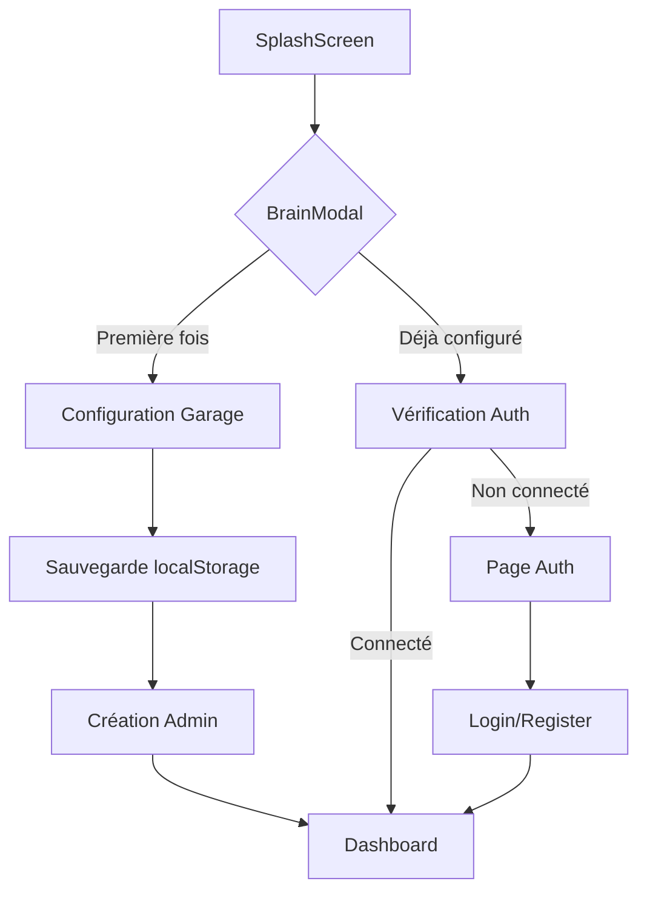
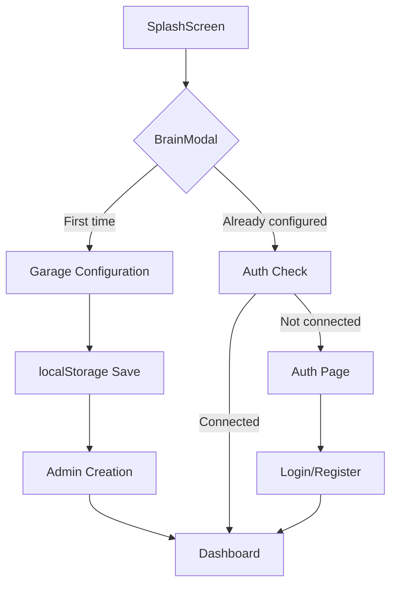

# 🚗 Garage 2024 - Guide de Démarrage / Getting Started Guide

---

## 🇫🇷 **GUIDE FRANÇAIS**

### 📋 **Vue d'ensemble**

**Garage 2024** est une application de gestion complète pour garages automobiles, développée par **Thierry Gogo** (Fullstack Developer Freelance). Elle permet de gérer les clients, véhicules, réparations, stock et finances en **Franc CFA (FCFA)**.

### 🚀 **Première Connexion**

#### 1. **Lancement de l'Application**
```bash
npm run dev
# Accédez à http://localhost:8081
```

#### 2. **Configuration Initiale**
Lors du premier lancement, vous verrez :

1. **Splash Screen** avec animation de chargement
2. **Modal de configuration** (`BrainModal.tsx`) :
   - Nom du garage (ex: "Garage Excellence Abidjan")
   - Nom du propriétaire (ex: "Thierry Gogo")
   - Adresse complète
   - Téléphone (+225)
   - Email
   - Logo (PNG/JPG, max 2MB)

#### 3. **Validation des Données**
```typescript
// Validation téléphone Côte d'Ivoire
const phoneRegex = /^\+225[0-9]{8}$/;
// Format attendu : +225 07 58 96 61 56
```

### 🏗️ **Architecture Technique**

#### **Structure des Composants**
```
src/
├── components/
│   ├── Auth/           # Authentification
│   ├── BrainModal.tsx  # Configuration initiale
│   ├── SplashScreen.tsx # Écran de chargement
│   └── ui/             # Composants UI (shadcn/ui)
├── contexts/
│   └── ThemeContext.tsx # Gestion thème sombre/clair
├── hooks/
│   └── useBrainSetup.ts # Logique configuration
├── pages/              # Pages principales
└── routes/
    ├── PrivateRoute.tsx # Protection routes
    └── AuthRedirect.tsx # Redirection auth
```

#### **Flux d'Authentification**


### 🎯 **Fonctionnalités Principales**

#### **Dashboard** (`/app/dashboard`)
- **Statistiques** : Interventions, clients, véhicules, CA
- **Chiffre d'affaires** : 8 250 000 FCFA (exemple)
- **Graphiques** : Évolution mensuelle

#### **Gestion Clients** (`/app/clients/liste`)
- **8 clients** avec noms ivoiriens
- **Statuts** : Nouveau, Actif, VIP
- **Informations** : Téléphone +225, adresses Abidjan
- **Véhicules** : Toyota, Peugeot, Renault, etc.

#### **Réparations** (`/app/reparations`)
- **6 réparations** en cours/terminées
- **Prix** : 25 000 à 180 000 FCFA
- **Statuts** : En attente, En cours, Terminé
- **Descriptions** : Vidange, freinage, moteur, etc.

#### **Stock** (`/app/stock`)
- **9 articles** : Filtres, plaquettes, batteries, etc.
- **Prix** : 1 200 à 45 000 FCFA
- **Seuils d'alerte** : Gestion automatique
- **Fournisseurs** : Total CI, Brembo, etc.

### ⚙️ **Configuration Avancée**

#### **Paramètres** (`/app/settings`)
```typescript
// Configuration par défaut
const settings = {
  currency: 'XOF',        // Franc CFA
  language: 'fr',         // Français
  theme: 'light',         // Thème clair/sombre
  notifications: {
    email: true,
    push: true,
    sms: false
  }
};
```

#### **Thème Sombre**
- **Activation** : Settings → Affichage → Mode sombre
- **Composants** : Tous adaptés (cf. `ThemeContext.tsx`)
- **Couleurs** : Palette orange-rouge cohérente

### 🔧 **Développement**

#### **Installation**
```bash
git clone [repository]
cd garage-abidjan-dashboard
npm install
npm run dev
```

#### **Variables d'Environnement**
```bash
# .env.local
VITE_SUPABASE_URL=your_supabase_url
VITE_SUPABASE_ANON_KEY=your_supabase_key
```

#### **Structure Base de Données**
```sql
-- Tables principales (cf. supabase/migrations/)
- profiles          # Utilisateurs
- garage_config     # Configuration garage
- clients           # Clients
- vehicles          # Véhicules
- repairs           # Réparations
- stock             # Stock
- notifications     # Notifications
```

---

## 🇬🇧 **ENGLISH GUIDE**

### 📋 **Overview**

**Garage 2024** is a comprehensive automotive garage management application developed by **Thierry Gogo** (Fullstack Developer Freelance). It manages clients, vehicles, repairs, inventory, and finances in **CFA Franc (FCFA)**.

### 🚀 **First Connection**

#### 1. **Application Launch**
```bash
npm run dev
# Access http://localhost:8081
```

#### 2. **Initial Setup**
On first launch, you'll see:

1. **Splash Screen** with loading animation
2. **Configuration modal** (`BrainModal.tsx`):
   - Garage name (e.g., "Garage Excellence Abidjan")
   - Owner name (e.g., "Thierry Gogo")
   - Complete address
   - Phone (+225)
   - Email
   - Logo (PNG/JPG, max 2MB)

#### 3. **Data Validation**
```typescript
// Ivory Coast phone validation
const phoneRegex = /^\+225[0-9]{8}$/;
// Expected format: +225 07 58 96 61 56
```

### 🏗️ **Technical Architecture**

#### **Component Structure**
```
src/
├── components/
│   ├── Auth/           # Authentication
│   ├── BrainModal.tsx  # Initial configuration
│   ├── SplashScreen.tsx # Loading screen
│   └── ui/             # UI components (shadcn/ui)
├── contexts/
│   └── ThemeContext.tsx # Dark/light theme management
├── hooks/
│   └── useBrainSetup.ts # Configuration logic
├── pages/              # Main pages
└── routes/
    ├── PrivateRoute.tsx # Route protection
    └── AuthRedirect.tsx # Auth redirection
```

#### **Authentication Flow**


### 🎯 **Main Features**

#### **Dashboard** (`/app/dashboard`)
- **Statistics** : Interventions, clients, vehicles, revenue
- **Revenue** : 8,250,000 FCFA (example)
- **Charts** : Monthly evolution

#### **Client Management** (`/app/clients/liste`)
- **8 clients** with Ivorian names
- **Statuses** : New, Active, VIP
- **Information** : +225 phone, Abidjan addresses
- **Vehicles** : Toyota, Peugeot, Renault, etc.

#### **Repairs** (`/app/reparations`)
- **6 repairs** in progress/completed
- **Prices** : 25,000 to 180,000 FCFA
- **Statuses** : Pending, In Progress, Completed
- **Descriptions** : Oil change, brakes, engine, etc.

#### **Inventory** (`/app/stock`)
- **9 items** : Filters, brake pads, batteries, etc.
- **Prices** : 1,200 to 45,000 FCFA
- **Alert thresholds** : Automatic management
- **Suppliers** : Total CI, Brembo, etc.

### ⚙️ **Advanced Configuration**

#### **Settings** (`/app/settings`)
```typescript
// Default configuration
const settings = {
  currency: 'XOF',        // CFA Franc
  language: 'fr',         // French
  theme: 'light',         // Light/dark theme
  notifications: {
    email: true,
    push: true,
    sms: false
  }
};
```

#### **Dark Theme**
- **Activation** : Settings → Display → Dark mode
- **Components** : All adapted (see `ThemeContext.tsx`)
- **Colors** : Consistent orange-red palette

### 🔧 **Development**

#### **Installation**
```bash
git clone [repository]
cd garage-abidjan-dashboard
npm install
npm run dev
```

#### **Environment Variables**
```bash
# .env.local
VITE_SUPABASE_URL=your_supabase_url
VITE_SUPABASE_ANON_KEY=your_supabase_key
```

#### **Database Structure**
```sql
-- Main tables (see supabase/migrations/)
- profiles          # Users
- garage_config     # Garage configuration
- clients           # Clients
- vehicles          # Vehicles
- repairs           # Repairs
- stock             # Inventory
- notifications     # Notifications
```

---

## 🎯 **Raccourcis Clavier / Keyboard Shortcuts**

| Action | Windows/Linux | Mac |
|--------|---------------|-----|
| Dashboard | `Ctrl + 1` | `Cmd + 1` |
| Clients | `Ctrl + 2` | `Cmd + 2` |
| Réparations | `Ctrl + 3` | `Cmd + 3` |
| Stock | `Ctrl + 4` | `Cmd + 4` |
| Paramètres | `Ctrl + ,` | `Cmd + ,` |
| Thème sombre | `Ctrl + T` | `Cmd + T` |
| Recherche | `Ctrl + K` | `Cmd + K` |

---

## 📞 **Support**

**Développeur** : Thierry Gogo
**Email** : contact@garage-abidjan.com
**Téléphone** : +225 07 58 96 61 56
**Stack** : React/TypeScript + Supabase
**Version** : 2.0.0 - FCFA Edition

---

*Documentation générée le : Janvier 2024*
*Dernière mise à jour : Configuration FCFA complète*
