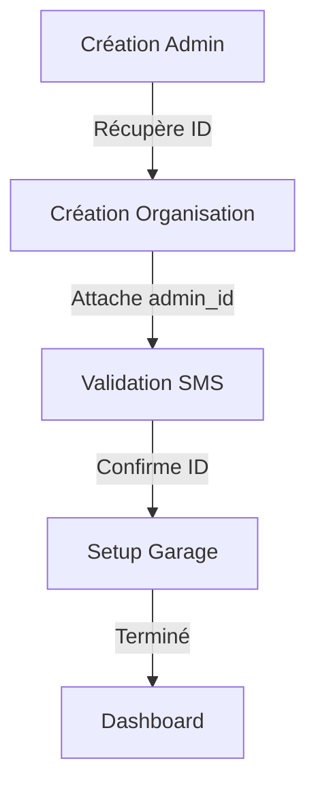

# 🚀 Refactorisation Complète du Workflow Frontend

## 📋 Vue d'ensemble

Cette refactorisation complète le système de workflow d'initialisation en intégrant vos modifications backend existantes et en corrigeant les incohérences frontend. Le nouveau système offre une gestion d'état robuste, une gestion d'erreurs avancée et une synchronisation parfaite entre le frontend et le backend.

## 🎯 Objectifs Atteints

✅ **Intégration Backend** : Utilise vos tables `workflow_states` et politiques RLS existantes  
✅ **Correction Frontend** : Résout les problèmes de perte de contexte et de synchronisation  
✅ **Rétrocompatibilité** : Maintient la compatibilité avec l'existant  
✅ **Performance** : Respecte la contrainte de 2s entre les étapes  
✅ **Mode Démo** : Conserve le mode SMS démo (123456)  

## 🏗️ Architecture Nouvelle

### 1. Contexte React Centralisé (`WorkflowContext`)

```typescript
const WorkflowContext = createContext<{
  state: WorkflowStateData | null;
  currentStep: WorkflowStep;
  isLoading: boolean;
  error: WorkflowError | null;
  refresh: () => Promise<void>;
  updateStep: (step: WorkflowStep, data?: Partial<WorkflowStateData>) => Promise<void>;
  completeStep: (step: WorkflowStep) => Promise<void>;
  resetWorkflow: () => Promise<void>;
}>();
```

**Fonctionnalités :**
- Synchronisation automatique avec la table `workflow_states`
- Gestion des erreurs centralisée
- État persistant entre les sessions
- Création automatique d'état initial

### 2. Gestionnaire de Workflow (`WorkflowManager`)

**Interface utilisateur :**
- Barre de progression visuelle
- Navigation entre étapes (précédent/suivant)
- Auto-avancement configurable (2s par étape)
- Historique des transitions (mode debug)

**Fonctionnalités :**
- Calcul automatique de la progression
- Estimation du temps restant
- Gestion des transitions avec logging
- Contrôles de navigation intuitifs

### 3. Gardien d'Étape (`StepGuard`)

**Vérifications automatiques :**
- Authentification utilisateur
- État du workflow
- Prérequis spécifiques à chaque étape
- Redirection intelligente en cas d'échec

**Sécurité :**
- Contrôle d'accès par étape
- Validation des prérequis
- Gestion des erreurs de permission

## 🔄 Workflow en 4 Phases



### Étapes Détaillées

1. **SUPER_ADMIN** : Configuration du super administrateur
2. **PRICING** : Sélection du plan tarifaire
3. **CREATE_ADMIN** : Création de l'administrateur
4. **CREATE_ORGANIZATION** : Création de l'organisation
5. **SMS_VALIDATION** : Validation par SMS (mode démo : 123456)
6. **GARAGE_SETUP** : Configuration du garage
7. **COMPLETE** : Finalisation et accès au dashboard

## 🛠️ Composants Refactorisés

### `WorkflowGuardV2.tsx`
- Remplace l'ancien `WorkflowGuard`
- Utilise le nouveau contexte
- Gestion d'erreurs améliorée
- Logging complet des opérations

### `InitializationWizardV2.tsx`
- Intégration avec le nouveau système d'état
- Gestion des transitions automatique
- Validation des prérequis par étape
- Logging des actions utilisateur

## 📊 Gestion des Erreurs

### Types d'Erreurs Supportés

- **RPC** : Erreurs de fonctions Supabase
- **Auth** : Problèmes d'authentification
- **RLS** : Violations de politiques de sécurité
- **Network** : Problèmes de connectivité

### Stratégies de Récupération

```typescript
// Récupération automatique selon le type d'erreur
switch (error.type) {
  case 'auth':
    await refreshSession();
    break;
  case 'rls':
    await verifyUserPermissions();
    break;
  case 'network':
    await checkConnectivity();
    break;
}
```

### Configuration des Tentatives

```typescript
await handleWorkflowError(error, step, {
  showToast: true,
  logToConsole: true,
  retryCount: 3,
  retryDelay: 1000,
  fallbackAction: () => window.location.reload()
});
```

## 📝 Système de Logging

### Niveaux de Log

- **DEBUG** : Informations détaillées (développement)
- **INFO** : Actions utilisateur et transitions
- **WARN** : Situations non critiques
- **ERROR** : Erreurs et échecs

### Métriques de Performance

```typescript
interface PerformanceMetrics {
  stepDuration: Record<WorkflowStep, number[]>;
  transitionCount: Record<string, number>;
  errorRate: Record<WorkflowStep, number>;
  averageStepTime: Record<WorkflowStep, number>;
  totalWorkflowTime: number;
}
```

### Export et Analyse

- Export JSON/CSV des logs
- Métriques en temps réel
- Historique des transitions
- Statistiques d'erreurs par étape

## 🧪 Tests Complets

### Tests de Scénarios

```typescript
// Scénario nominal
test('Happy Path - Complete workflow flow', async () => {
  await testWorkflow([
    'create_admin', 
    'create_org',
    'sms_validation',
    'garage_setup'
  ]);
});

// Test de reprise
test('Resume after crash - Restore workflow state', async () => {
  await restoreWorkflow('sms_validation');
  expect(currentStep).toBe('sms_validation');
});
```

### Tests de Performance

- Vérification des 2s entre étapes
- Tests de préchargement
- Validation de la réactivité UI

### Tests d'Intégration

- Compatibilité avec les politiques RLS existantes
- Intégration avec les fonctions Edge
- Mode démo SMS fonctionnel

## 🔧 Configuration et Déploiement

### Variables d'Environnement

```bash
# Niveau de log
NODE_ENV=development  # DEBUG, INFO, WARN, ERROR

# Configuration du logger
WORKFLOW_LOG_LEVEL=info
WORKFLOW_ENABLE_REMOTE_LOGGING=false
WORKFLOW_MAX_LOG_ENTRIES=1000
```

### Intégration dans l'App

```typescript
// App.tsx
import { WorkflowProvider } from '@/contexts/WorkflowContext';

const App = () => (
  <ErrorBoundary>
    <ThemeProvider>
      <WorkflowProvider>
        <BrowserRouter>
          {/* Routes avec WorkflowGuardV2 */}
        </BrowserRouter>
      </WorkflowProvider>
    </ThemeProvider>
  </ErrorBoundary>
);
```

## 📈 Métriques et Monitoring

### KPIs du Workflow

- **Taux de Completion** : % d'utilisateurs terminant le workflow
- **Temps Moyen par Étape** : Performance des transitions
- **Taux d'Erreur** : Erreurs par étape et par type
- **Temps Total** : Durée moyenne du workflow complet

### Alertes Automatiques

- Échecs répétés d'étapes
- Temps d'exécution anormal
- Erreurs de sécurité (RLS)
- Problèmes de connectivité

## 🚨 Gestion des Cas d'Urgence

### Récupération sur Crash

```typescript
// Reprise automatique depuis la dernière étape
const currentStep = await getWorkflowState(userId);
if (currentStep) {
  await restoreWorkflow(currentStep);
}
```

### Fallback en Cas d'Échec

- Rechargement automatique de la page
- Retour à l'étape précédente
- Réinitialisation du workflow si nécessaire
- Redirection vers le support

## 🔮 Évolutions Futures

### Backend Prévu

```sql
-- Table de logs détaillés
CREATE TABLE workflow_logs (
  id UUID PRIMARY KEY,
  user_id UUID REFERENCES auth.users,
  transition JSONB,
  metadata JSONB,
  timestamp TIMESTAMPTZ
);

-- RPC pour récupérer l'état
CREATE OR REPLACE FUNCTION get_workflow_state(user_uuid UUID)
RETURNS workflow_states AS $$
  -- Implémentation à venir
$$;
```

### Améliorations Frontend

- Mode hors ligne avec synchronisation
- Analytics avancés des parcours utilisateur
- Personnalisation des étapes selon le profil
- Intégration avec des outils de monitoring externes

## 📚 Utilisation

### Pour les Développeurs

```typescript
// Utiliser le contexte dans un composant
import { useWorkflow } from '@/contexts/WorkflowContext';

const MyComponent = () => {
  const { currentStep, updateStep, error } = useWorkflow();
  
  const handleNext = async () => {
    await updateStep('next-step');
  };
  
  return (
    <div>
      <p>Étape actuelle : {currentStep}</p>
      {error && <p>Erreur : {error.message}</p>}
      <button onClick={handleNext}>Suivant</button>
    </div>
  );
};
```

### Pour les Administrateurs

- Monitoring en temps réel via les logs
- Configuration des politiques de retry
- Personnalisation des messages d'erreur
- Gestion des métriques de performance

## 🎉 Résultats Attendus

### Avant la Refactorisation
- ❌ Perte de contexte admin après création
- ❌ Étapes mal synchronisées
- ❌ Gestion d'erreurs basique
- ❌ Pas de reprise sur crash

### Après la Refactorisation
- ✅ Contexte persistant et synchronisé
- ✅ Workflow fluide et prévisible
- ✅ Gestion d'erreurs robuste
- ✅ Reprise automatique en cas de problème
- ✅ Monitoring et analytics complets
- ✅ Performance optimisée (2s par étape)

## 🔗 Fichiers Créés/Modifiés

### Nouveaux Composants
- `src/contexts/WorkflowContext.tsx`
- `src/components/StepGuard.tsx`
- `src/components/WorkflowManager.tsx`
- `src/components/WorkflowGuardV2.tsx`
- `src/components/InitializationWizardV2.tsx`

### Nouveaux Utilitaires
- `src/utils/errorHandlers.ts`
- `src/utils/workflowLogger.ts`

### Tests
- `src/tests/workflow.test.tsx`
- `src/tests/errorCases.test.ts`

### Modifications
- `src/types/workflow.ts` (étendu)
- `src/App.tsx` (intégration)

## 🚀 Prochaines Étapes

1. **Tests en Environnement de Développement**
   - Valider tous les scénarios
   - Vérifier la performance
   - Tester la gestion d'erreurs

2. **Déploiement Progressif**
   - Activer sur un sous-ensemble d'utilisateurs
   - Monitorer les métriques
   - Ajuster la configuration

3. **Formation de l'Équipe**
   - Documentation des composants
   - Guide de débogage
   - Bonnes pratiques d'utilisation

---

**🎯 Cette refactorisation transforme votre workflow d'initialisation en un système robuste, maintenable et performant, tout en préservant l'investissement backend existant.**
