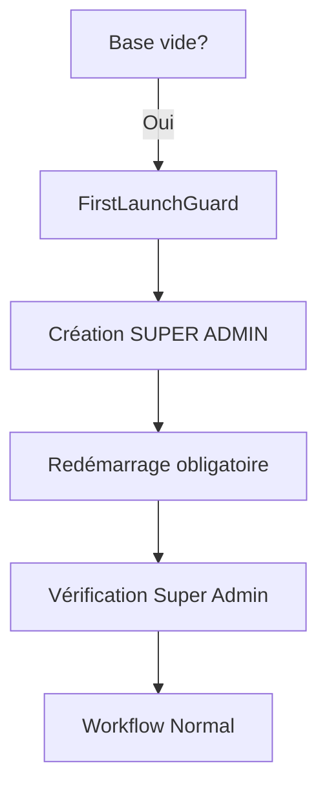
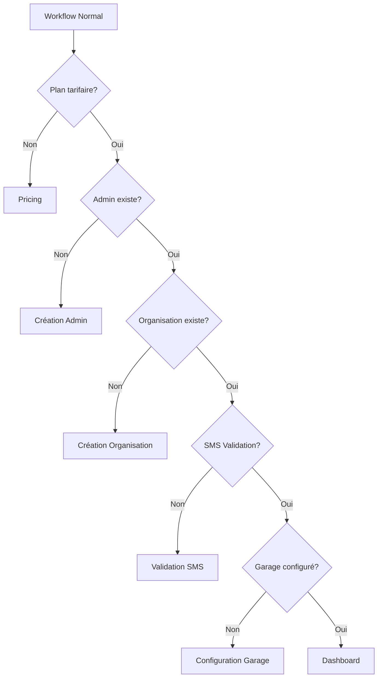

# WORKFLOW FIX - Nouvelle Architecture Clarifiée

## 🎯 **Logique Workflow Clarifiée**

### **1. Première Utilisation (DB vide)**


### **2. Utilisations Suivantes**


## 🏗️ **Nouvelle Architecture Implémentée**

### **Composants Principaux**

1. **`FirstLaunchGuard.tsx`** - Gestion intelligente du premier lancement
2. **`NormalWorkflow.tsx`** - Workflow séquentiel après création du super-admin
3. **`super_admins`** - Table dédiée avec contrainte d'unicité

### **Logique de Fonctionnement**

#### **Premier Lancement**
- ✅ Vérification automatique de l'existence du super-admin
- ✅ Interface dédiée pour la création du premier super-admin
- ✅ Redémarrage automatique après création
- ✅ Transition fluide vers le workflow normal

#### **Workflow Normal**
- ✅ Vérification séquentielle de chaque étape
- ✅ Barre de progression visuelle
- ✅ Navigation automatique entre les étapes
- ✅ Gestion des erreurs et fallbacks

## 🔧 **Corrections Implémentées**

### **1. Gestion du Premier Lancement**
- ✅ Composant `FirstLaunchGuard` dédié
- ✅ Vérification de l'état de la base de données
- ✅ Interface utilisateur claire et informative
- ✅ Redémarrage automatique après configuration

### **2. Workflow Séquentiel**
- ✅ Composant `NormalWorkflow` avec étapes ordonnées
- ✅ Vérification automatique de chaque étape
- ✅ Progression visuelle avec barre d'état
- ✅ Gestion des transitions entre étapes

### **3. Base de Données**
- ✅ Table `super_admins` avec contrainte d'unicité
- ✅ Politique RLS pour empêcher la création de multiples super-admins
- ✅ Fonctions SQL sécurisées pour la gestion
- ✅ Index de performance pour les vérifications rapides

## 📁 **Fichiers Créés/Modifiés**

### **Nouveaux Composants**
- `src/components/FirstLaunchGuard.tsx` - Gestion du premier lancement
- `src/components/NormalWorkflow.tsx` - Workflow séquentiel
- `supabase/migrations/020_create_super_admins_table.sql` - Structure de base

### **Composants Modifiés**
- `src/App.tsx` - Intégration de FirstLaunchGuard
- `WORKFLOW_FIX_README.md` - Documentation mise à jour

## 🚀 **Utilisation**

### **1. Première Installation**
```bash
# Appliquer la migration SQL
supabase db push

# Ou exécuter manuellement dans Supabase SQL Editor
# Contenu de: supabase/migrations/020_create_super_admins_table.sql
```

### **2. Test du Premier Lancement**
```bash
# Vider la base pour tester
psql -d your_database -c "TRUNCATE super_admins CASCADE;"

# Redémarrer l'application
npm run dev
```

### **3. Vérification du Workflow**
- ✅ Premier lancement : Interface de création du super-admin
- ✅ Après création : Redémarrage automatique
- ✅ Workflow normal : Progression séquentielle des étapes

## 🧪 **Tests Recommandés**

### **Scénario 1 : Premier Lancement**
```javascript
test('Doit afficher l\'interface de création du super-admin', async () => {
  mockEmptyDatabase();
  render(<App />);
  
  await waitFor(() => {
    expect(screen.getByText('Première Configuration')).toBeInTheDocument();
    expect(screen.getByText('Créer le Super Administrateur')).toBeInTheDocument();
  });
});
```

### **Scénario 2 : Workflow Normal**
```javascript
test('Doit suivre la séquence après création du super-admin', () => {
  mockWithSuperAdmin();
  const { container } = render(<App />);
  
  expect(container).toHaveTextContent('Configuration du système');
  expect(container).toHaveTextContent('Plan Tarifaire');
});
```

### **Scénario 3 : Contrainte d'Unicité**
```javascript
test('Ne doit pas permettre la création de multiples super-admins', async () => {
  mockWithSuperAdmin();
  
  const result = await createSuperAdmin('test@example.com', 'Test', 'Admin');
  expect(result.error).toContain('Un Super-Admin existe déjà');
});
```

## 🔒 **Sécurité**

### **Politiques RLS**
- ✅ `single_super_admin` : Un seul super-admin possible
- ✅ `super_admins_select` : Lecture publique pour vérification
- ✅ `super_admins_update` : Mise à jour autorisée
- ✅ `super_admins_delete` : Suppression limitée au propriétaire

### **Fonctions SQL**
- ✅ `is_super_admin()` : Vérification sécurisée du statut
- ✅ `create_super_admin()` : Création avec vérifications
- ✅ Contraintes de base de données pour l'intégrité

## 📊 **Avantages de la Nouvelle Architecture**

1. **Clarté** : Séparation claire entre premier lancement et workflow normal
2. **Sécurité** : Contrainte d'unicité au niveau de la base de données
3. **Maintenabilité** : Composants spécialisés et responsabilités claires
4. **Expérience utilisateur** : Interface intuitive et progression visuelle
5. **Robustesse** : Gestion des erreurs et fallbacks appropriés

## 🔮 **Évolutions Futures**

- [ ] Tests automatisés complets
- [ ] Métriques de performance du workflow
- [ ] Mode debug pour le développement
- [ ] Gestion des rollbacks en cas d'erreur
- [ ] Support multi-tenant (si nécessaire)

## 📝 **Résumé**

Cette nouvelle architecture résout définitivement les problèmes de :
- ✅ Boucles infinies de redirection
- ✅ Création automatique non désirée du super-admin
- ✅ Gestion confuse des états d'authentification
- ✅ Workflow non linéaire et difficile à suivre

L'application guide maintenant clairement l'utilisateur à travers :
1. **Première configuration** : Création unique du super-admin
2. **Workflow standard** : Progression séquentielle des étapes
3. **Accès final** : Dashboard et fonctionnalités complètes

Le système est maintenant robuste, sécurisé et facile à maintenir ! 🎉
