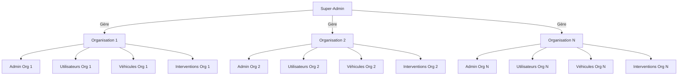

# Architecture Multi-Instances - Garage Pro

## Vue d'ensemble

L'architecture multi-instances permet de gérer plusieurs organisations (garages) dans une seule application, avec une isolation complète des données et une gestion centralisée par un Super-Admin.

## Architecture



## Workflow d'Initialisation

### 1. Vérification Super-Admin
- **Condition** : Table `super_admins` vide
- **Action** : Affichage modal de création Super-Admin (bloquante)
- **Champs** : email, mot de passe, téléphone, nom complet
- **Composant** : `SuperAdminSetupModal`

### 2. Sélection du Plan
- **Condition** : Super-Admin existe, aucune organisation
- **Action** : Affichage sélecteur de plans (Gratuit/Mensuel/À VIE)
- **Composant** : `PricingModal`

### 3. Création de l'Organisation
- **Condition** : Plan sélectionné
- **Action** : Modal de création d'organisation
- **Champs** : nom, code, adresse, téléphone, email, site web, description
- **Composant** : `OrganisationCRUDModal`

### 4. Configuration de l'Admin
- **Condition** : Organisation créée
- **Action** : Modal de création de l'administrateur d'organisation
- **Champs** : email, mot de passe, téléphone, nom complet
- **Composant** : `AdminCRUDModal`

### 5. Authentification
- **Condition** : Toutes les étapes précédentes validées
- **Action** : Redirection vers `/auth` avec double onglet
- **Fonctionnalités** : sélecteur d'organisation, upload avatar, thème toggleable

## Composants Principaux

### Hooks

#### `useMultiInstanceSetup`
Gère l'état global de l'initialisation multi-instances.

```typescript
interface SetupState {
  step: 'checking' | 'super-admin' | 'pricing' | 'organisation' | 'admin' | 'auth' | 'complete';
  isLoading: boolean;
  error: string | null;
  hasSuperAdmin: boolean;
  hasOrganisations: boolean;
  selectedPlan: string | null;
  organisationData: any | null;
}
```

### Guards

#### `MultiTenantAuthGuard`
Middleware d'authentification avec journalisation des accès.

**Fonctionnalités** :
- Vérification de l'initialisation multi-instances
- Validation des permissions par rôle
- Journalisation des tentatives d'accès
- Redirection automatique selon le contexte

**Props** :
```typescript
interface MultiTenantAuthGuardProps {
  children: React.ReactNode;
  requireAuth?: boolean;
  requireOrganisation?: boolean;
  allowedRoles?: string[];
}
```

### Modals

#### `SuperAdminSetupModal`
Modal de création du Super-Admin avec design WhatsApp-like.

#### `PricingModal`
Sélecteur de plans avec animations et design moderne.

#### `OrganisationCRUDModal`
Création d'organisation avec validation et génération automatique de slug.

#### `AdminCRUDModal`
Création de l'administrateur d'organisation.

## Base de Données

### Tables Principales

#### `super_admins`
```sql
CREATE TABLE public.super_admins (
    id UUID PRIMARY KEY REFERENCES auth.users(id),
    email TEXT NOT NULL UNIQUE,
    nom TEXT NOT NULL,
    prenom TEXT NOT NULL,
    phone TEXT,
    est_actif BOOLEAN DEFAULT true,
    created_at TIMESTAMP WITH TIME ZONE DEFAULT NOW(),
    updated_at TIMESTAMP WITH TIME ZONE DEFAULT NOW()
);
```

#### `access_logs`
```sql
CREATE TABLE public.access_logs (
    id UUID PRIMARY KEY DEFAULT gen_random_uuid(),
    timestamp TIMESTAMP WITH TIME ZONE DEFAULT NOW(),
    path TEXT NOT NULL,
    user_id UUID REFERENCES auth.users(id),
    user_email TEXT,
    organisation_id UUID REFERENCES public.organisations(id),
    success BOOLEAN NOT NULL,
    reason TEXT,
    user_agent TEXT,
    ip_address TEXT,
    created_at TIMESTAMP WITH TIME ZONE DEFAULT NOW()
);
```

### Politiques RLS

#### Isolation des Données
- Chaque organisation ne peut voir que ses propres données
- Les Super-Admins ont accès à toutes les organisations
- Les Admins d'organisation gèrent leurs utilisateurs

#### Sécurité
- Journalisation de tous les accès
- Validation des permissions par ressource
- Chiffrement des credentials

## Edge Functions

### `multi-tenant-context`
Gère le contexte multi-tenant et la journalisation.

**Actions** :
- `set_organisation_context` : Définit le contexte organisationnel
- `log_access` : Journalise les tentatives d'accès
- `get_user_context` : Récupère le contexte utilisateur
- `validate_access` : Valide l'accès à une ressource

## Sécurité

### Isolation des Données
- RLS (Row Level Security) sur toutes les tables
- Politiques par organisation et rôle
- Validation côté serveur et client

### Journalisation
- Toutes les tentatives d'accès sont journalisées
- Informations : utilisateur, organisation, chemin, succès/échec
- Audit trail complet pour la sécurité

### Authentification
- Supabase Auth avec gestion des sessions
- Rôles hiérarchiques : Super-Admin > Admin > Utilisateur
- Validation multi-facteurs possible

## Interface Utilisateur

### Design System
- **Style** : WhatsApp-like avec animations fluides
- **Thème** : Toggle clair/sombre
- **Responsive** : Mobile-first design
- **Animations** : Transitions fluides entre étapes

### Composants UI
- Modals avec backdrop blur
- Formulaires avec validation en temps réel
- Indicateurs de progression
- Messages d'erreur contextuels

## Déploiement

### Migrations
1. Exécuter `014_multi_instance_setup.sql`
2. Déployer l'Edge Function `multi-tenant-context`
3. Configurer les variables d'environnement

### Configuration
```bash
# Variables d'environnement requises
SUPABASE_URL=your_supabase_url
SUPABASE_ANON_KEY=your_supabase_anon_key
SUPABASE_SERVICE_ROLE_KEY=your_service_role_key
```

## Utilisation

### Premier Déploiement
1. L'application vérifie automatiquement l'état initial
2. Si aucun Super-Admin : affichage modal de création
3. Suivi du workflow d'initialisation étape par étape
4. Redirection automatique vers le dashboard

### Gestion des Organisations
- Les Super-Admins peuvent créer/gérer toutes les organisations
- Chaque organisation a son propre administrateur
- Isolation complète des données entre organisations

### Monitoring
- Logs d'accès dans la table `access_logs`
- Dashboard de monitoring pour les Super-Admins
- Alertes en cas d'accès non autorisés

## Avantages

### Pour les Super-Admins
- Gestion centralisée de toutes les organisations
- Monitoring et audit complets
- Flexibilité dans la gestion des plans

### Pour les Organisations
- Isolation complète des données
- Personnalisation de leur environnement
- Scalabilité selon leurs besoins

### Pour les Développeurs
- Architecture modulaire et extensible
- Code réutilisable et maintenable
- Sécurité intégrée dès la conception

## Évolutions Futures

### Fonctionnalités Prévues
- API REST pour intégrations tierces
- Webhooks pour notifications
- Dashboard analytics avancé
- Système de facturation automatisé

### Améliorations Techniques
- Cache Redis pour les performances
- CDN pour les assets statiques
- Monitoring temps réel
- Backup automatisé

---

**Note** : Cette architecture garantit une isolation complète des données tout en permettant une gestion centralisée efficace. Le workflow d'initialisation assure une expérience utilisateur fluide et sécurisée.
