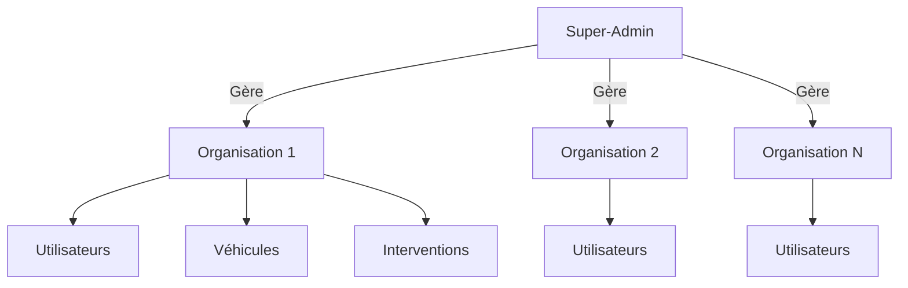
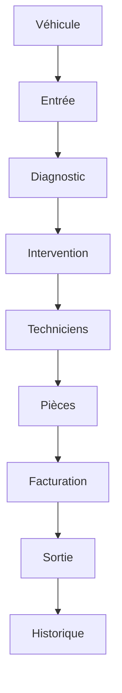
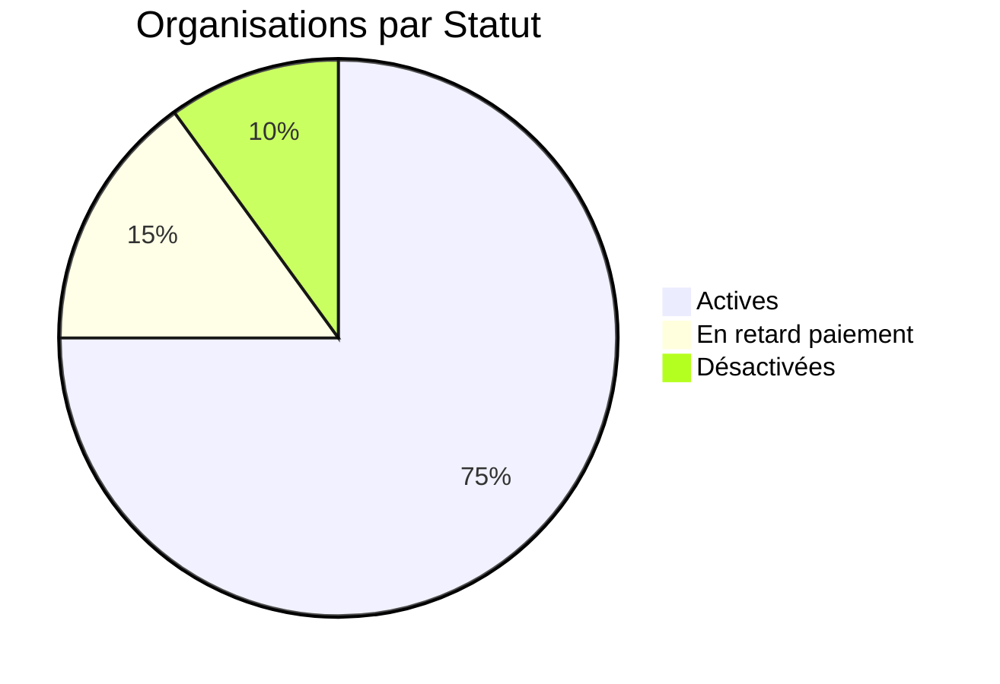

Voici une refonte complète du workflow multi-instance avec gestion du super-admin, intégrant vos besoins techniques et métier :

### Architecture Multi-Instance


### Workflow Révisé

**1. Initialisation de l'application**
- À la première ouverture : 
  ```mermaid
  graph LR
      A[Détection DB vide] --> B[Modal Pricing]
      B --> C{Paiement réussi?}
      C -->|Oui| D[Création Super-Admin]
      D --> E[Création Première Organisation]
      E --> F[Configuration Brand]
  ```

**2. Compte Super-Admin**  
*Créé automatiquement au premier paiement :*
```json
{
  "email": "2024dibo@gmail.com",
  "password": "O2024Mano",
  "phone": "+2250758966156",
  "full_name": "Thierry Gogo",
  "role": "super_admin",
  "title": "Développeur Fullstack"
}
```

**3. Gestion des Organisations**
- **Table Organisations** :
  ```sql
  CREATE TABLE organisations (
    id UUID PRIMARY KEY DEFAULT uuid_generate_v4(),
    name VARCHAR(255) NOT NULL,
    code VARCHAR(50) UNIQUE NOT NULL,
    subscription_type VARCHAR(20) CHECK (subscription_type IN ('monthly','lifetime')),
    subscription_end DATE,
    is_active BOOLEAN DEFAULT true,
    created_at TIMESTAMPTZ DEFAULT NOW()
  );
  ```
- Droits Super-Admin :
  - ✅ Visualiser toutes les organisations
  - ✅ Activer/désactiver l'accès
  - ⏰ Gérer les abonnements
  - 🔐 Réinitialiser les mots de passe admin
  - 🚫 Bloquer les instances frauduleuses

**4. Workflow d'Authentification**
```mermaid
sequenceDiagram
    Utilisateur->>Application: Accès initial
    Application->>DB: Check cookies session
    alt Session valide
        DB-->>Application: organisation_id
        Application->>Dashboard: Redirect
    else Pas de session
        Application->>DB: Check organisations
        alt Organisations existent
            Application->>/auth: Redirect
        else Aucune organisation
            Application->>Modal Pricing: Open
        end
    end
```

**5. Pricing & Abonnements**
| Type        | Prix       | Paiement       | Accès                     |
|-------------|------------|----------------|---------------------------|
| Mensuel     | 20 000 FCFA| Wave/Orange    | CRUD complet              |
| À vie       | 200 000 FCFA| Mobile Money   | + Fonctions premium       |

**6. Configuration Organisation**
*Après création :*
1. Création compte admin local
2. Configuration du brand :
   - 🏢 Logo/Nom entreprise
   - 👤 Propriétaire
   - 📞 Contacts
   - 📍 Adresse physique
   - 📑 RCCM/NIF
   - 🏷️ Types d'activités (multi-select)

**7. Modules Garage**


**8. Fonctionnalités Clés**
- **Traçabilité complète** : Chauffeur → Propriétaire → Interventions
- **Signature numérique** : Validation électronique des réparations
- **Alerte sécurité** : Signalement fraudes/anomalies avec preuves
- **Multi-activités** : Garage + Lavage + Buvette dans 1 instance

**9. Sécurité & Conformité**
- Row-Level Security (RLS) sur toutes les tables
- Chiffrement des données sensibles
- Journalisation des actions critiques
- Sauvegardes automatiques quotidiennes

**10. Workflow Technique**
```javascript
// Middleware d'authentification
const multiTenantAuth = (req, res, next) => {
  const orgId = req.cookies.organisation_id;
  
  if (!orgId) {
    if (hasOrganisations()) return res.redirect('/auth');
    else return showPricingModal();
  }
  
  // Vérification accès organisation
  if (!userHasAccess(req.user, orgId)) {
    handleSecurityAlert(req.user, 'Tentative accès non autorisé');
    return res.status(403).send('Accès refusé');
  }
  
  next();
};
```

### Dashboard Super-Admin
**Vue Globale :**


**Actions Immédiates :**
- 🔄 Renouveler abonnement
- 🔓 Débloquer instance
- 📊 Générer rapport financier
- 👥 Contacter administrateur

### Évolution Possible
1. **API de Paiement Automatisée** : Webhooks pour mise à jour auto des abonnements
2. **Espace Client** : Portail propriétaires de véhicules
3. **Mobile Sync** : Application terrain pour techniciens
4. **BI Integrée** : Tableaux de bord analytiques

Cette architecture permet :
- ✅ Isolation des données par organisation
- ✅ Modèle économique SaaS clair
- ✅ Administration centralisée
- ✅ Scalabilité horizontale
- ✅ Maintenance simplifiée

Le tout utilisant une seule base Supabase avec RLS et `organisation_id` sur toutes les tables métier.